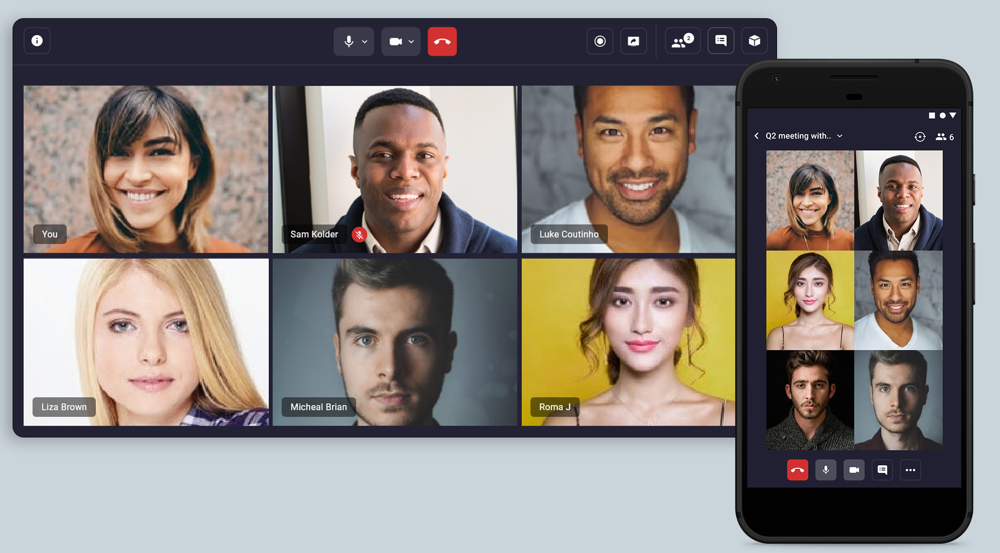

# Video SDK React App

## What is it?

This code sample demonstrates a one-to-one and group video call application built with [Video SDK RTC React SDK](https://docs.videosdk.live/docs/realtime-communication/sdk-reference/react-sdk/setup), [Video SDK RTC JS SDK](https://docs.videosdk.live/docs/realtime-communication/sdk-reference/javascript-sdk/setup)

- Built for serverless video calling experience.
- Scale it upto 5,000 participants with low code.
- 10,000 minutes free on monthly basis



## Features

- [x] Video API with real-time audio, video and data streams
- [x] 5,000+ participants support
- [x] Chat support with rich media.
- [x] Screen sharing with HD and Full HD.
- [x] Play realtime video in meeting
- [x] Connect it with social media such as Facebook, Youtube etc (RTMP out support).
- [x] Intelligent speaker switch
- [x] Record your meetings on cloud
- [x] Customise UI and built other rich features with our new data streams such as whiteboard, poll, Q & A etc.

## Browser Support

Visit our official guide for [Browser Support](https://docs.videosdk.live/docs/realtime-communication/see-also/device-browser-support)

## Prerequisites

You must have the following installed:

- Node.js v12+
- NPM v6+ (comes installed with newer Node versions)

## Install Dependencies

Run npm install to install all dependencies from NPM.

```sh
$ npm install
```

If you want to use yarn to install dependencies, first run the yarn import command. This will ensure that yarn installs the package versions that are specified in package-lock.json.

## Running the Authentication server

Before running app, you need to run the authentication server

Use our official [videosdk-rtc-nodejs-sdk-example](https://github.com/videosdk-live/videosdk-rtc-nodejs-sdk-example) to perform server authentication.

```sh
$ git clone https://github.com/videosdk-live/videosdk-rtc-nodejs-sdk-example
```

Add API Key and Secret in `.env` of your project.

```sh
ZUJONOW_API_KEY=''
ZUJONOW_SECRET_KEY=''
ZUJONOW_API_ENDPOINT=https://api.zujonow.com
```

Visit, [https://www.videosdk.live/](https://www.videosdk.live/) to generate API keys and secret.

Related

- [Video SDK RTC Prebuillt No Code App](https://github.com/videosdk-live/videosdk-rtc-js-prebuilt-embedded-example)
- [Video SDK RTC React Native App](https://github.com/videosdk-live/videosdk-rtc-react-native-sdk-example)
- [Video SDK RTC Node JS App](https://github.com/videosdk-live/videosdk-rtc-nodejs-sdk-example)
