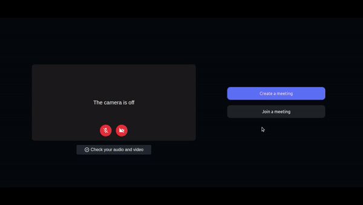
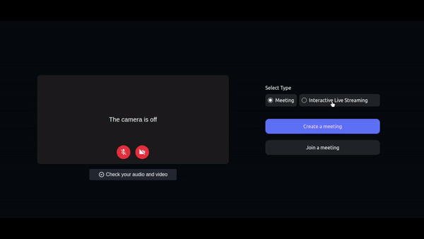
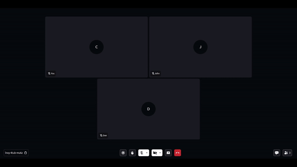
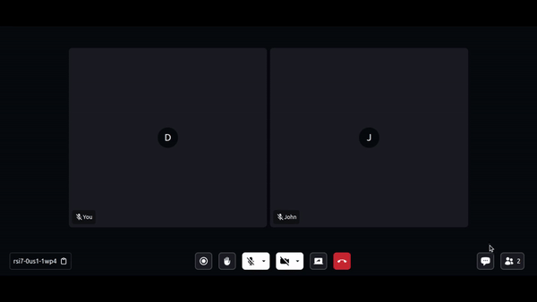
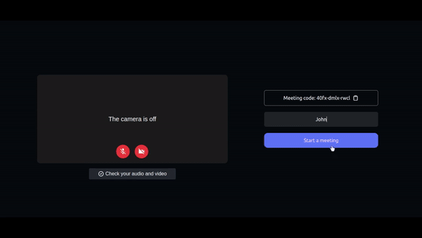
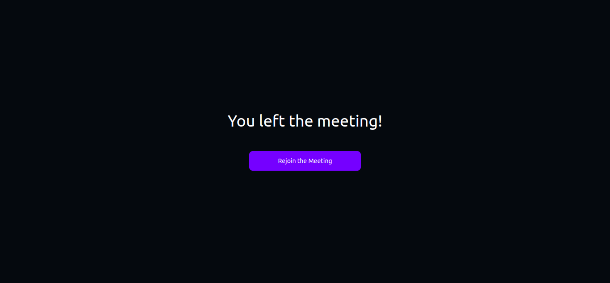
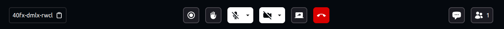
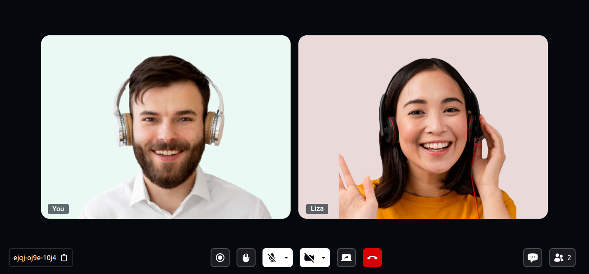

# Video SDK for React JS

[](https://docs.videosdk.live/react/guide/video-and-audio-calling-api-sdk/concept-and-architecture)
[](https://discord.gg/kgAvyxtTxv)
[](https://app.videosdk.live/signup)

At Video SDK, we’re building tools to help companies create world-class collaborative products with capabilities of live audio/videos, compose cloud recordings/rtmp/hls and interaction APIs

## Demo App

Check out demo [here](https://videosdk.live/prebuilt/demo)

## Meeting Features

- [x] Real-time video and audio conferencing
- [x] Enable/disable camera
- [x] Mute/unmute mic
- [x] Chat
- [x] Raise hand
- [x] Screen share
- [x] Recording

<br/>

## Setup Guide

- Sign up on [VideoSDK](https://app.videosdk.live/) and visit [API Keys](https://app.videosdk.live/api-keys) section to get your API key and Secret key.

- Get familiarized with [Token](https://docs.videosdk.live/react/guide/video-and-audio-calling-api-sdk/authentication-and-token)

<br/>

### Prerequisites

- React Js 16 or later
- Node 10 or later
- Valid [Video SDK Account](https://app.videosdk.live/signup)

## Run the Sample App

### Step 1: Clone the sample project

Clone the repository to your local environment.

```js
git clone https://github.com/videosdk-live/videosdk-rtc-react-sdk-example.git
```

### Step 2: Copy the .env.example file to .env file.

Open your favorite code editor and copy `.env.example` to `.env` file.

```js
cp.env.example.env;
```

### Step 3: Modify .env file

Generate temporary token from [Video SDK Account](https://app.videosdk.live/signup).

```js title=".env"
REACT_APP_VIDEOSDK_TOKEN = "TEMPORARY-TOKEN";
```

### Step 4: Install the dependecies

Install all the dependecies to run the project.

```js
npm install
```

### Step 5: Run the Sample App

Bingo, it's time to push the launch button.

```js
npm run start
```

<br/>

## [Key Concepts](https://docs.videosdk.live/react/guide/video-and-audio-calling-api-sdk/concept-and-architecture)

- `Meeting` - A Meeting represents Real time audio and video communication.

  **`Note : Don't confuse with Room and Meeting keyword, both are same thing 😃`**

- `Sessions` - A particular duration you spend in a given meeting is a referred as session, you can have multiple session of a particular meetingId.
- `Participant` - Participant represents someone who is attending the meeting's session, `local partcipant` represents self (You), for this self, other participants are `remote participants`.
- `Stream` - Stream means video or audio media content that is either published by `local participant` or `remote participants`.

<br/>

## Token Generation

Token is used to create and validate a meeting using API and also initialise a meeting.

🛠️ `Development Environment`:

- You may use a temporary token for development. To create a temporary token, go to VideoSDK [dashboard](https://app.videosdk.live/api-keys) .

🌐 `Production Environment`:

- You must set up an authentication server to authorise users for production. To set up an authentication server, refer to our official example repositories. [videosdk-rtc-api-server-examples](https://github.com/videosdk-live/videosdk-rtc-api-server-examples)

<br/>

## API: Create and Validate meeting

- `create meeting` - Please refer this [documentation](https://docs.videosdk.live/api-reference/realtime-communication/create-room) to create meeting.
- `validate meeting`- Please refer this [documentation](https://docs.videosdk.live/api-reference/realtime-communication/validate-room) to validate the meetingId.

<br/>

## [Initialize a Meeting](https://docs.videosdk.live/react/guide/video-and-audio-calling-api-sdk/setup-call/initialise-meeting)

- You can initialize the meeting using `MeetingProvider`. Meeting Provider simplifies configuration of meeting with by wrapping up core logic with `react-context`.

```js
<MeetingProvider
  config={{
    meetingId: "meeting-id",
    micEnabled: true,
    webcamEnabled: true,
    name: "Participant Name",
    participantId: "xyz",
    // For Interactive Live Streaming we can provide mode, `CONFERENCE` for Host and  `VIEWER` for remote participant.
    mode: "CONFERENCE", // "CONFERENCE" || "VIEWER"
  }}
  token={"token"}
  joinWithoutUserInteraction // Boolean
></MeetingProvider>
```

<br/>

## [Enable/Disable Local Webcam](https://docs.videosdk.live/react/guide/video-and-audio-calling-api-sdk/handling-media/on-off-camera)

```js
const onPress = () => {
  // Enable Webcam in Meeting
  meeting?.enableWebcam();

  // Disable Webcam in Meeting
  meeting?.disableWebcam();
};
```

<br/>

## [Change Local Webcam](https://docs.videosdk.live/react/guide/video-and-audio-calling-api-sdk/handling-media/change-input-device#changing-camera-input-device)

```js
const onPress = () => {
const webcams = await meeting?.getWebcams(); // returns all webcams

const { deviceId, label } = webcams[0];

meeting?.changeWebcam(deviceId);
}
```

<br/>

## [Mute/Unmute Local Audio](https://docs.videosdk.live/react/guide/video-and-audio-calling-api-sdk/handling-media/mute-unmute-mic)

```js
const onPress = () => {
  // Enable Mic in Meeting
  meeting?.unmuteMic();

  // Disable Mic in Meeting
  meeting?.muteMic();
};
```

<br/>

## [Change Local Mic](https://docs.videosdk.live/react/guide/video-and-audio-calling-api-sdk/handling-media/change-input-device#changing-audio-input-device)

```js
const onPress = () => {
const mics = await meeting?.getMics(); // returns all mics

const { deviceId, label } = mics[0];

meeting?.changeMic(deviceId);
}
```

<br/>

## [Chat](https://docs.videosdk.live/react/guide/video-and-audio-calling-api-sdk/collaboration-in-meeting/chat-using-pubsub)

- The chat feature allows participants to send and receive messages about specific topics to which they have subscribed.

```js
// importing usePubSub hook from react-sdk
import { usePubSub } from "@videosdk.live/react-sdk";

// CHAT Topic
const { publish, messages } = usePubSub("CHAT");

// publish message
const sendMessage = () => {
  const message = "Hello People!";
  publish(message, { persist: true });
};

// get latest messages
console.log("Messages : ", messages);
```

<br/>

## [Raise Hand](https://docs.videosdk.live/react/guide/video-and-audio-calling-api-sdk/collaboration-in-meeting/pubsub)

- This feature allows participants to raise hand during the meeting.

```js
// importing usePubSub hook from react-sdk
import { usePubSub } from "@videosdk.live/react-sdk";

// RAISE_HAND Topic
const { publish } = usePubSub("RAISE_HAND");

// Publish Message
const RaiseHand = () => {
  publish("Raise Hand");
};
```

<br/>

## [Share Your Screen](https://docs.videosdk.live/react/guide/video-and-audio-calling-api-sdk/handling-media/screen-share)

- This featute allows participant to share either the complete screen, a specific window or, a browser tab.

```js
const onPress = () => {
  // Enabling ScreenShare
  meeting?.enableScreenShare();

  // Disabling ScreenShare
  meeting?.disableScreenShare();
};
```

<br/>

## [Recording](https://docs.videosdk.live/react/guide/video-and-audio-calling-api-sdk/recording-and-live-streaming/record-meeting)

- Record meeting allows participants to record video & audio during the meeting. The recording files are available in developer dashboard. Any participant can start / stop recording any time during the meeting.

```js
const onPress = () => {
  // Start Recording
  meeting?.startRecording(webhookUrl, awsDirPath);

  // Stop Recording
  meeting?.stopRecording();
};
```

<br/>

## [Interactive Live Streaming](https://docs.videosdk.live/react/guide/video-and-audio-calling-api-sdk/recording-and-live-streaming/interactive-livestream)

- Interactive Live Streaming allows participants to to broadcast live streaming to other participants. Host can start / stop HLS any time during the meeting.

```js
const onPress = () => {
  // Start HLS
  const layout = {
    type: "SPOTLIGHT",
    priority: "PIN",
    gridSize: 9,
  },

  meeting?.startHls({ layout, theme: "DARK" });

  // Stop HLS
  meeting?.stopHls();
};
```

<br/>

## [Leave or End Meeting](https://docs.videosdk.live/react/guide/video-and-audio-calling-api-sdk/setup-call/leave-end-meeting)

```js
const onPress = () => {
  // Only one participant will leave/exit the meeting; the rest of the participants will remain.
  meeting?.leave();

  // The meeting will come to an end for each and every participant. So, use this function in accordance with your requirements.
  meeting?.end();
};
```

<br/>

## [Meeting Event callbacks](https://docs.videosdk.live/react/api/sdk-reference/use-meeting/events)

By registering callback handlers, VideoSDK sends callbacks to the client app whenever there is a change or update in the meeting after a user joins.

```js
function onMeetingJoined() {
  // This event will be emitted when a localParticipant(you) successfully joined the meeting.
  console.log("onMeetingJoined");
}
function onMeetingLeft() {
  // This event will be emitted when a localParticipant(you) left the meeting.
  console.log("onMeetingLeft");
}
function onParticipantJoined(participant) {
  // This event will be emitted when a new participant joined the meeting.
  // [participant]: new participant who joined the meeting
  console.log(" onParticipantJoined", participant);
}
function onParticipantLeft(participant) {
  // This event will be emitted when a joined participant left the meeting.
  // [participantId]: id of participant who left the meeting
  console.log(" onParticipantLeft", participant);
}
const onSpeakerChanged = (activeSpeakerId) => {
  // This event will be emitted when any participant starts or stops screen sharing.
  // [activeSpeakerId]: Id of participant who shares the screen.
  console.log(" onSpeakerChanged", activeSpeakerId);
};
function onPresenterChanged(presenterId) {
  // This event will be emitted when a active speaker changed.
  // [presenterId] : Id of active speaker
  console.log(" onPresenterChanged", presenterId);
}
function onRecordingStarted() {
  // This event will be emitted when recording of the meeting is started.
  console.log(" onRecordingStarted");
}
function onRecordingStopped() {
  // This event will be emitted when recording of the meeting is stopped.
  console.log(" onRecordingStopped");
}

const { meetingId, meeting, localParticipant } = useMeeting({
  onMeetingJoined,
  onMeetingLeft,
  onParticipantJoined,
  onParticipantLeft,
  onSpeakerChanged,
  onPresenterChanged,
  onRecordingStarted,
  onRecordingStopped,
});
```

<br/>

## [Participant Events Callback](https://docs.videosdk.live/react/api/sdk-reference/use-participant/events)

By registering callback handlers, VideoSDK sends callbacks to the client app whenever a participant's video, audio, or screen share stream is enabled or disabled.

```js
  function onStreamEnabled(stream) {
    // This event will be triggered whenever a participant's video, audio or screen share stream is enabled.
    console.log(" onStreamEnabled", stream);
  }
  function onStreamDisabled(stream) {
    // This event will be triggered whenever a participant's video, audio or screen share stream is disabled.
    console.log(" onStreamDisabled", stream);
  }
  function onMediaStatusChanged(data) {
    // This event will be triggered whenever a participant's video or audio is disabled or enabled.
    const { kind, newStatus} = data;

    console.log("onMediaStatusChanged", kind,newStatus)

  }

  const {
    displayName
    ...
  } = useParticipant(participantId,{
    onStreamEnabled,
    onStreamDisabled,
    onMediaStatusChanged,
  });
```

If you want to learn more about the SDK, read the Complete Documentation of [React VideoSDK](https://docs.videosdk.live/react/api/sdk-reference/setup)

<br/>

## Project Description

<br/>

> **Note :**
>
> - **main** branch: Meeting and Interactive live streaming with better UI includes basic features.
> - **design/v1** branch: Simple UI with all features and methods.

<br/>

## Use case type

- **Meeting** - In `Meeting` you can enable mic and webcam, record the meeting, raise hand, chat, share your screen.

<br/>

## Project Structure

There are 1 folder :

1. [`meeting`](https://github.com/videosdk-live/videosdk-rtc-react-sdk-example/tree/main/src/meeting) - This folder includes components or file related to meeting.

<br/>

## Common components

**1. Create or join Meeting**

- [`components/screens/JoiningScreen.js`](https://github.com/videosdk-live/videosdk-rtc-react-sdk-example/blob/main/src/components/screens/JoiningScreen.js) : It shows the user with the option to meeting type and create or join a meeting and to initiate webcam and mic status.

- `api.js` : It includes all the API calls for create and validate meeting.

- If you select `Meeting` type and click `Create Meeting`, it will show following:

  - `MeetingId` - You can copy this meetingId and share it with other participants that wants to join the meeting.
  - `TextField for ParticipantName` - This text field will contain name of the participant.
  - `Start Meeting Button` - This button will call api to create meeting with meetingId that participant want to join.

  <p align="center">
  
  </p>

- If you select `Meeting` type and click `Join Meeting`, it will show following:

  - `TextField for MeetingId` - This text field will contain the meeting Id that you want to join.
  - `TextField for ParticipantName` - This text field will contain name of the participant.
  - `Join Meeting Button` - This button will call api to validate meeting with meetingId that participant want to join.

  <p align="center">
  
  </p>

- If you select `Interactive Live Streaming` type and click `Join as a Host`, it will show following:

  - `Studio code` - You can copy this studio code and share with other participants that wants to join the meeting.
  - `TextField for ParticipantName` - This text field will contain name of the participant.
  - `Join Studio Button` - This button will call api to create meeting with studio code that participant want to join.

  <p align="center">
  
  </p>

- If you select `Interactive Live Streaming` type and click `Join as a Viewer`, it will show following:

  - `TextField for StudioCode` - This text field will contain the studio code that you want to join.
  - `TextField for ParticipantName` - This text field will contain name of the participant.
  - `Join Streaming Room Button` - This button will call api to validate meeting with studio code that viewer want to join.

  <p align="center">
  
  </p>

**2. PresenterView**

[`components/PresenterView.js`](https://github.com/videosdk-live/videosdk-rtc-react-sdk-example/blob/main/src/components/PresenterView.js) - It contains the view when participant share their screen.

<p align="center">

</p>

**3. ParticipantView**

[`components/ParticipantView.js`](https://github.com/videosdk-live/videosdk-rtc-react-sdk-example/blob/main/src/components/ParticipantView.js) - It contains single participant video and corner display name.

**4. ParticipantGrid**

[`components/ParticipantGrid.js`](https://github.com/videosdk-live/videosdk-rtc-react-sdk-example/blob/main/src/components/ParticipantGrid.js) - It contains the grid of participant that are displayed in the main screen.

**5. ParticipantList**

[`sidebar/ParticipantPanel.js`](https://github.com/videosdk-live/videosdk-rtc-react-sdk-example/blob/main/src/components/sidebar/ParticipantPanel.js) - This file is used to show the list of participants present in the meeting.

<p align="center">

</p>

**6. Chat**

[`sidebar/ChatPanel.js`](https://github.com/videosdk-live/videosdk-rtc-react-sdk-example/blob/main/src/components/sidebar/ChatPanel.js) - It contains the chat side panel with chat input and chat messages list.

<p align="center">

</p>

**7. Waiting Screen**

[`components/screens/WaitingToJoin.js`](https://github.com/videosdk-live/videosdk-rtc-react-sdk-example/blob/main/src/components/screens/WaitingToJoinScreen.js) - It contains the lottie animation with messages. Untill you receive `isMeetingJoined` true from `meeting` that you intialize using `useMeeting()` from `@videosdk.live/react-sdk`, this screen will be displayed.

<p align="center">

</p>

**8. Leave Screen**

[`components/screens/LeaveScreen.js`](https://github.com/videosdk-live/videosdk-rtc-react-sdk-example/blob/main/src/components/screens/LeaveScreen.js) - This file contains the leave screen.

<p align="center">

</p>

**9. SidebarContainer**

- [`components/sidebar/SidebarContainer.js`](https://github.com/videosdk-live/videosdk-rtc-react-sdk-example/blob/main/src/components/sidebar/SidebarContainer.js) - It containes `Participanel`, `ChatPanel`, `CreatePoll`, `PollList` and `SubmitPollList` component rendering.

<br/>

## Meeting Project Structure

**1. MeetingContainer** : It contains the `PresenterView` , `ParticipantView`, `SidebarContainer` and `BottomBar`.

**2. Meeting Bottom Bar**

- [`meeting/components/BottomBar.js`](https://github.com/videosdk-live/videosdk-rtc-react-sdk-example/blob/main/src/meeting/components/BottomBar.js): It contains the buttons that are displayed in bottom of the screen.

  - Starting from left it shows meetingId with copy icon button.
  - In middle, it shows recording indicator, raise hand icon button, mic icon button with available mics list, webcam icon button with available webcam list, screen share and leave meeting icon button.
  - In right most corner, it shows chat icon button and partcipants icon with participant count.

  - When screen resolution change to mobile, tab or lg screen, the order of bottom bar elements changes to leave meeting button, recording button, mic & webcam button and `more actions` button.
  - On click of `more actions` button it opens a drawer that contains other remaining buttons.

<p align="center">

</p>

**3. ParticipantView**

- [`meeting/components/ParticipantView.js`](https://github.com/videosdk-live/videosdk-rtc-react-sdk-example/blob/main/src/meeting/components/ParticipantView.js) - It contains the grid of participant that are displayed in the main screen.

<p align="center">

</p>

<br/>

## Examples 
### Examples for Conference

- [videosdk-rtc-prebuilt-examples](https://github.com/videosdk-live/videosdk-rtc-prebuilt-examples)
- [videosdk-rtc-javascript-sdk-example](https://github.com/videosdk-live/videosdk-rtc-javascript-sdk-example)
- [videosdk-rtc-react-sdk-examplee](https://github.com/videosdk-live/videosdk-rtc-react-sdk-example)
- [videosdk-rtc-react-native-sdk-example](https://github.com/videosdk-live/videosdk-rtc-react-native-sdk-example)
- [videosdk-rtc-flutter-sdk-example](https://github.com/videosdk-live/videosdk-rtc-flutter-sdk-example)
- [videosdk-rtc-android-java-sdk-example](https://github.com/videosdk-live/videosdk-rtc-android-java-sdk-example)
- [videosdk-rtc-android-kotlin-sdk-example](https://github.com/videosdk-live/videosdk-rtc-android-kotlin-sdk-example)
- [videosdk-rtc-ios-sdk-example](https://github.com/videosdk-live/videosdk-rtc-ios-sdk-example)

### Examples for Live Streaming

- [videosdk-hls-react-sdk-example](https://github.com/videosdk-live/videosdk-hls-react-sdk-example)
- [videosdk-hls-react-native-sdk-example](https://github.com/videosdk-live/videosdk-hls-react-native-sdk-example)
- [videosdk-hls-flutter-sdk-example](https://github.com/videosdk-live/videosdk-hls-flutter-sdk-example)
- [videosdk-hls-android-java-example](https://github.com/videosdk-live/videosdk-hls-android-java-example)
- [videosdk-hls-android-kotlin-example](https://github.com/videosdk-live/videosdk-hls-android-kotlin-example)

## Documentation

[Read the documentation](https://docs.videosdk.live/) to start using Video SDK.

## Community

- [Discord](https://discord.gg/Gpmj6eCq5u) - To get involved with the Video SDK community, ask questions and share tips.
- [Twitter](https://twitter.com/video_sdk) - To receive updates, announcements, blog posts, and general Video SDK tips.
