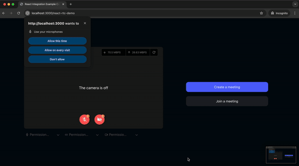
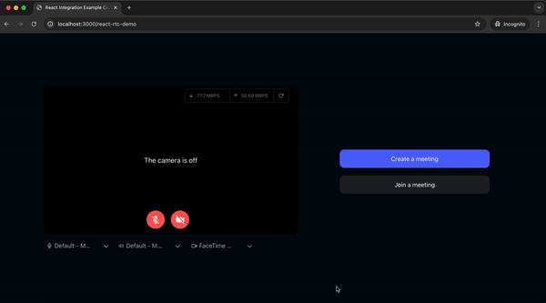

# 🚀 Video SDK for React JS

[](https://docs.videosdk.live/react/guide/video-and-audio-calling-api-sdk/concept-and-architecture)
[](https://discord.gg/kgAvyxtTxv)
[](https://app.videosdk.live/signup)

At Video SDK, we’re building tools to help companies create world-class collaborative products with capabilities of live audio/videos, compose cloud recordings/rtmp/hls and interaction APIs

## 📚 **Table of Contents**

- [🖥️ **Demo App**](#%EF%B8%8F-demo-app)
- [⚡ **Quick Setup**](#-quick-setup)
- [🔧 **Prerequisites**](#-prerequisites)
- [📦 **Running the Sample App**](#-running-the-sample-app)
- [🔥 **Meeting Features**](#-meeting-features)
- [🧠 **Key Concepts**](#-key-concepts)
- [🔑 **Token Generation**](#-token-generation)
- [📋 **Project Overview**](#-project-overview)
- [🗂️ **Project Structure**](#%EF%B8%8F-project-structure)
- [🧩 **Feature List with Associated Components**](##-feature-list-with-associated-components)
- [📖 **Examples**](#-examples)
- [📝 **VideoSDK's Documentation**](#-documentation)
- [💬 **Join Our Community**](#-join-our-community)


## 🖥️ Demo App

Curious to see it in action? Check out our [live demo here](https://videosdk.live/prebuilt/demo). 

## ⚡ Quick Setup

1. Sign up on [VideoSDK](https://app.videosdk.live/) to grab your API Key and Secret.
2. Get familiarized with [Token](https://docs.videosdk.live/react/guide/video-and-audio-calling-api-sdk/authentication-and-token)

## 🛠 Prerequisites

- **React** v16 or later
- **Node** v10 or later
- A valid [Video SDK Account](https://app.videosdk.live/signup)

## 📦 Running the Sample App

Follow these steps to get the sample app up and running:

### Step 1: Clone the Repository

```bash
git clone https://github.com/videosdk-live/videosdk-rtc-react-sdk-example.git
```

### Step 2: Set Up Environment Variables

Copy the example environment file:

```bash
cp .env.example .env
```

### Step 3: Configure Your `.env` File

Generate a temporary token from your [**Video SDK Account**](https://app.videosdk.live/signup) and update the `.env` file:

```env
REACT_APP_VIDEOSDK_TOKEN="YOUR_TEMPORARY_TOKEN"
```

### Step 4: Install Dependencies

Navigate to the project directory and install the necessary packages:

```bash
npm install
```

### Step 5: Launch the App

Bingo, it's time to push the launch button.

```bash
npm run start
```


## 🔥 Meeting Features

Unlock a suite of powerful features to enhance your meetings:

| Feature                        | Documentation                                                                                                                | Description                                                                                                      |
|--------------------------------|------------------------------------------------------------------------------------------------------------------------------|------------------------------------------------------------------------------------------------------------------|
| 📋 **Precall Setup**           | [Setup Precall](https://docs.videosdk.live/react/guide/video-and-audio-calling-api-sdk/setup-call/precall)                   | Configure audio, video devices and other settings before joining the meeting.                                              |
| ⏳ **Waiting Lobby**           | [Waiting Lobby](https://docs.videosdk.live/react/guide/video-and-audio-calling-api-sdk/setup-call/waiting-lobby)             | Virtual space for participants to wait before joining the meeting.                                               |
| 🤝 **Join Meeting**            | [Join Meeting](https://docs.videosdk.live/react/guide/video-and-audio-calling-api-sdk/setup-call/join-meeting)                | Allows participants to join a meeting.                                                                 |
| 🎤 **Toggle Mic**         | [Mic Control](https://docs.videosdk.live/react/guide/video-and-audio-calling-api-sdk/handling-media/mute-unmute-mic)          | Toggle the microphone on or off during a meeting.                                                                  |
| 📷 **Toggle Camera**           | [Camera Control](https://docs.videosdk.live/react/guide/video-and-audio-calling-api-sdk/handling-media/on-off-camera)         | Turn the video camera on or off during a meeting.                                                                  |
| 🖥️ **Screen Share**            | [Screen Share](https://docs.videosdk.live/react/guide/video-and-audio-calling-api-sdk/handling-media/screen-share)          | Share your screen with other participants during the call.                                                      |
| 📸 **Image Capture**           | [Image Capturer](https://docs.videosdk.live/react/guide/video-and-audio-calling-api-sdk/handling-media/image-capturer)        | Capture images of other participant from their video stream, particularly useful for Video KYC and identity verification scenarios.     |
| 🔌 **Change Input Device**     | [Switch Input Devices](https://docs.videosdk.live/react/guide/video-and-audio-calling-api-sdk/handling-media/change-input-device)   | Switch between different audio and video input devices.                                                         |
| 🔊 **Change Audio Output**     | [Switch Audio Output](https://docs.videosdk.live/react/guide/video-and-audio-calling-api-sdk/handling-media/change-audio-ouptut-device) | Select an output device for audio during a meeting.                                                                |
| ⚙️ **Optimize Tracks**         | [Track Optimization](https://docs.videosdk.live/react/api/sdk-reference/custom-tracks)                                       | Enhance the quality and performance of media tracks.                                                            |
| 💬 **Chat**                    | [In-Meeting Chat](https://docs.videosdk.live/react/guide/video-and-audio-calling-api-sdk/collaboration-in-meeting/pubsub)      | Exchange messages with participants through a Publish-Subscribe mechanism.                                                   |
| 📝 **Whiteboard**              | [Whiteboard](https://docs.videosdk.live/react/guide/video-and-audio-calling-api-sdk/collaboration-in-meeting/whiteboard)      | Collaborate visually by drawing and annotating on a shared whiteboard.                                           |
| 📁 **File Sharing**            | [File Sharing](https://docs.videosdk.live/react/guide/video-and-audio-calling-api-sdk/collaboration-in-meeting/upload-fetch-temporary-file) | Share files with participants during the meeting.                                                               |
| 📼 **Recording**               | [Recording](https://docs.videosdk.live/react/guide/video-and-audio-calling-api-sdk/recording/Overview)                | Record the meeting for future reference.                                                                        |
| 📡 **RTMP Livestream**         | [RTMP Livestream](https://docs.videosdk.live/react/guide/video-and-audio-calling-api-sdk/live-streaming/rtmp-livestream)        | Stream the meeting live to platforms like YouTube or Facebook.                                                  |
| 📝 **Real-time Transcription**           | [Real-time Transcription](https://docs.videosdk.live/react/guide/video-and-audio-calling-api-sdk/transcription-and-summary/realtime-transcribe-meeting) | Generate real-time transcriptions of the meeting.                                                               |
| 🔇 **Toggle Remote Media**     | [Remote Media Control](https://docs.videosdk.live/react/guide/video-and-audio-calling-api-sdk/control-remote-participant/remote-participant-media) | Control the microphone or camera of remote participants.                                                        |
| 🚫 **Mute All Participants**   | [Mute All](https://docs.videosdk.live/react/guide/video-and-audio-calling-api-sdk/control-remote-participant/mute-all-participants) | Mute all participants simultaneously during the call.                                                           |
| 🗑️ **Remove Participant**      | [Remove Participant](https://docs.videosdk.live/react/guide/video-and-audio-calling-api-sdk/control-remote-participant/remove-participant) | Eject a participant from the meeting.                                                                           |
## 🧠 Key Concepts

Understand the core components of our SDK:

- `Meeting` - A Meeting represents Real time audio and video communication.

  **`Note : Don't confuse with Room and Meeting keyword, both are same thing 😃`**

- `Sessions` - A particular duration you spend in a given meeting is a referred as session, you can have multiple session of a particular meetingId.
- `Participant` - Participant represents someone who is attending the meeting's session, `local partcipant` represents self (You), for this self, other participants are `remote participants`.
- `Stream` - Stream means video or audio media content that is either published by `local participant` or `remote participants`.


## 🔐 Token Generation

Token is used to create and validate a meeting using API and also initialise a meeting.

🛠️ `Development Environment`:

- You may use a temporary token for development. To create a temporary token, go to VideoSDK [dashboard](https://app.videosdk.live/api-keys) .

🌐 `Production Environment`:

- You must set up an authentication server to authorise users for production. To set up an authentication server, refer to our official example repositories. [videosdk-rtc-api-server-examples](https://github.com/videosdk-live/videosdk-rtc-api-server-examples)


## 🔍 Project Overview

### 🔑 Branches

- **`main`**: Features meetings and interactive live streaming with an enhanced UI.
- **`design/v1`**: Offers a simple UI encompassing all features and methods.

## 🧩 Feature List with Associated Components

### 1. Pre-Call Setup on Join Screen

- **[components/DropDown.js](https://github.com/videosdk-live/videosdk-rtc-react-sdk-example/blob/main/src/components/DropDown.js)** : A dropdown component for selecting audio input devices (microphones), monitoring audio via the Web Audio API, and managing microphone settings.

- **[components/DropDownCam.js](https://github.com/videosdk-live/videosdk-rtc-react-sdk-example/blob/main/src/components/DropDownCam.js)** : A dropdown for selecting camera devices and managing camera permissions.

- **[components/DropDownSpeaker.js](https://github.com/videosdk-live/videosdk-rtc-react-sdk-example/blob/main/src/components/DropDownSpeaker.js)** : Allows users to select speakers, test them with sample sounds, and track playback progress for confirmation.

- **[components/NetworkStats.js](https://github.com/videosdk-live/videosdk-rtc-react-sdk-example/blob/main/src/components/NetworkStats.js)** : Displays real-time network statistics, such as upload and download speeds.

<p align="center">

</p>

### 2. Create or Join Meeting

- **[`components/screens/JoiningScreen.js`](https://github.com/videosdk-live/videosdk-rtc-react-sdk-example/blob/main/src/components/screens/JoiningScreen.js)** : Provides users the option to create or join a meeting, manage webcam and mic status, select devices (microphone, camera, speakers), check permissions, preview video, and monitor network statistics to ensure proper setup before entering the meeting.

- **`api.js`** : Includes all API calls for creating and validating meetings.

- **[`components/MeetingDetailsScreen.js`](https://github.com/videosdk-live/videosdk-rtc-react-sdk-example/blob/main/src/components/MeetingDetailsScreen.js)** : Displays options for creating or joining a meeting.

<p align="center">

</p>

### 3. Waiting Screen

- **[`components/screens/WaitingToJoin.js`](https://github.com/videosdk-live/videosdk-rtc-react-sdk-example/blob/main/src/components/screens/WaitingToJoinScreen.js)** : Displays a Lottie animation with messages while waiting to join the meeting. This screen is shown until the `isMeetingJoined` flag is true, which is received from the `meeting` initialized using `useMeeting()` from `@videosdk.live/react-sdk`.

<p align="center">

</p>

### 4. Participant View

- **[`components/ParticipantView.js`](https://github.com/videosdk-live/videosdk-rtc-react-sdk-example/blob/main/src/components/ParticipantView.js)** : Displays a single participant's video with a corner display for the participant's name.

- **[`components/ParticipantGrid.js`](https://github.com/videosdk-live/videosdk-rtc-react-sdk-example/blob/main/src/components/ParticipantGrid.js)** : Displays a grid of participants shown on the main screen.

- **[`meeting/components/ParticipantView.js`](https://github.com/videosdk-live/videosdk-rtc-react-sdk-example/blob/main/src/meeting/components/ParticipantView.js)** : Displays the grid of participants on the main screen.

<p align="center">

</p>

### 5. Meeting Bottom Bar

- **[`meeting/components/BottomBar.js`](https://github.com/videosdk-live/videosdk-rtc-react-sdk-example/blob/main/src/meeting/components/BottomBar.js)**  
  Contains the buttons displayed at the bottom of the screen:
  - Shows the meeting ID with a copy icon button on the left.
  - Displays the recording indicator, raise hand button, mic button (with a list of available mics), webcam button (with available webcam list), screen share button, and leave meeting button in the middle.
  - The rightmost corner contains the chat button and participant count button.
  - On mobile, tablet, or smaller screens, the bottom bar reorders to show the leave button, recording button, mic/webcam buttons, and a `more actions` button. The `more actions` button opens a drawer containing the remaining options.

<p align="center">

</p>

### 6. Presenter View

- **[`components/PresenterView.js`](https://github.com/videosdk-live/videosdk-rtc-react-sdk-example/blob/main/src/components/PresenterView.js)** : Displays the view when a participant shares their screen.

<p align="center">

</p>

### 7. Chat

- **[`sidebar/ChatPanel.js`](https://github.com/videosdk-live/videosdk-rtc-react-sdk-example/blob/main/src/components/sidebar/ChatPanel.js)** : Contains the chat side panel, with a chat input field and a list of chat messages.

<p align="center">

</p>

### 8. Participant List

- **[`sidebar/ParticipantPanel.js`](https://github.com/videosdk-live/videosdk-rtc-react-sdk-example/blob/main/src/components/sidebar/ParticipantPanel.js)** : Displays the list of participants present in the meeting.

<p align="center">

</p>

### 9. Leave Screen

- **[`components/screens/LeaveScreen.js`](https://github.com/videosdk-live/videosdk-rtc-react-sdk-example/blob/main/src/components/screens/LeaveScreen.js)** : Displays the leave screen when exiting the meeting.

<p align="center">

</p>

<br/>

## 📖 Examples

- [**Prebuilt Examples**](https://github.com/videosdk-live/videosdk-rtc-prebuilt-examples)
- [**JavaScript SDK Example**](https://github.com/videosdk-live/videosdk-rtc-javascript-sdk-example)
- [**React Native SDK Example**](https://github.com/videosdk-live/videosdk-rtc-react-native-sdk-example)
- [**Flutter SDK Example**](https://github.com/videosdk-live/videosdk-rtc-flutter-sdk-example)
- [**Android Java SDK Example**](https://github.com/videosdk-live/videosdk-rtc-android-java-sdk-example)
- [**Android Kotlin SDK Example**](https://github.com/videosdk-live/videosdk-rtc-android-kotlin-sdk-example)
- [**iOS SDK Example**](https://github.com/videosdk-live/videosdk-rtc-ios-sdk-example)


## 📝 Documentation

Explore more and start building with our [**Documentation**](https://docs.videosdk.live/)

## 🤝 Join Our Community

- **[Discord](https://discord.gg/Gpmj6eCq5u)**: Engage with the Video SDK community, ask questions, and share insights.
- **[Twitter](https://twitter.com/video_sdk)**: Stay updated with the latest news, updates, and tips from Video SDK.
